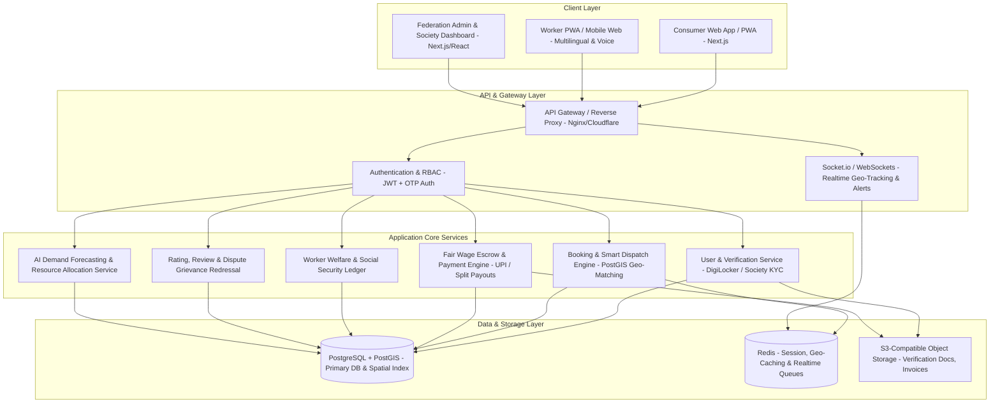
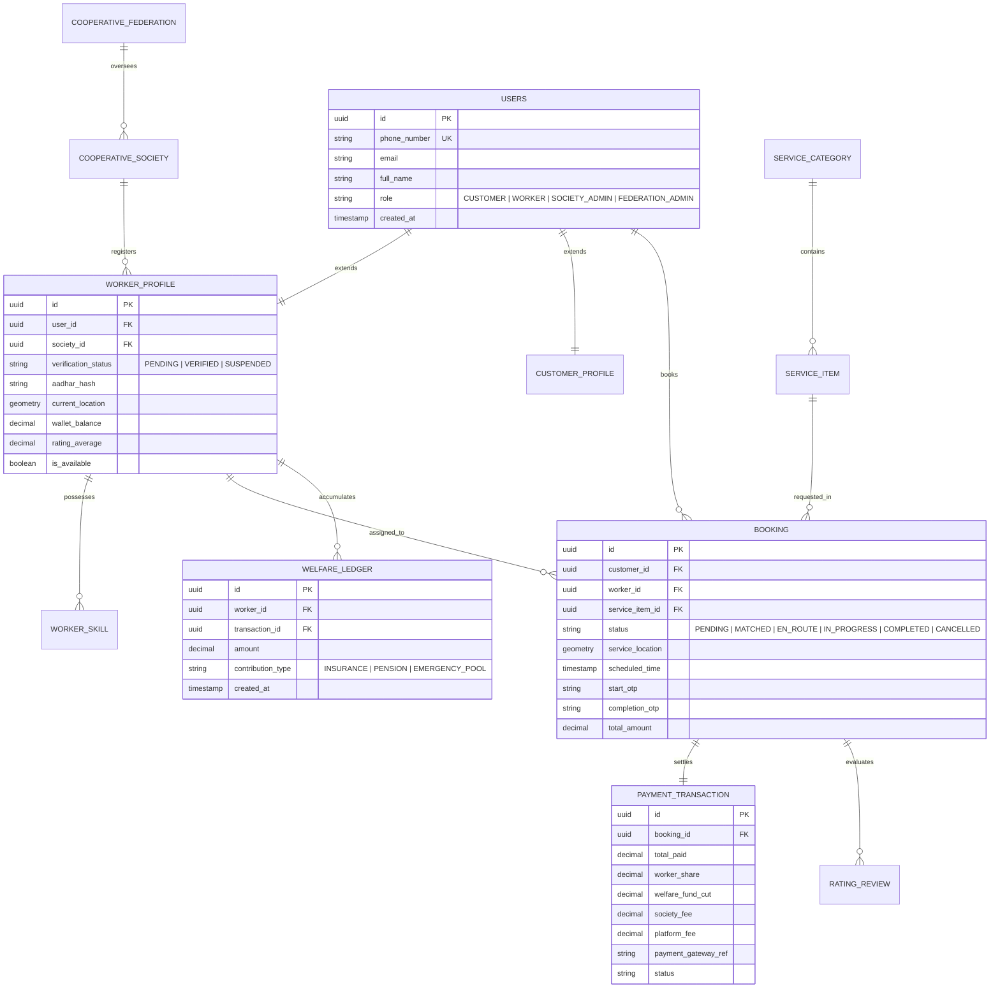
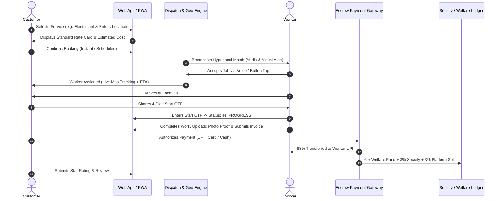

# Product Requirements Document (PRD)
## Project: **SahakarSetu (सहकार सेतु)** — Cooperative-Owned Digital Service Marketplace Platform
**Target Problem Statement:** Labour Cooperative Federation Digital Service Marketplace  
**Platform Scope:** Full-Stack Web Application (Responsive Web + Progressive Web App / Mobile-Ready)  
**Target Event/Context:** Smart India Hackathon (SIH) / Production-Grade Public Sector Implementation  
**Document Version:** 1.0.0  
**Status:** Approved for Implementation  

---

## 1. Executive Summary & Problem Context

### 1.1 Background
Labour Cooperative Federations and Primary Labour Cooperative Societies maintain extensive rosters of certified, skilled, and experienced blue-collar and pink-collar workers across trades (electricians, plumbers, carpenters, painters, domestic helpers, caregivers, drivers, gardeners, cleaning crews, appliance technicians). 

Despite having institutional backing, physical presence across districts, and skilled human resources, cooperative workers are largely invisible in the digital economy. High-commission gig-economy aggregators (charging 20% to 35% commission, algorithmic penalties, lack of welfare/insurance, and opaque wage calculations) dominate the urban market. Meanwhile, cooperative federations lack a modern digital platform to connect their workforce directly to households, residential welfare associations (RWAs), and institutional clients (schools, government offices, private enterprises).

### 1.2 Mission & Strategic Objectives
**SahakarSetu** is an open, transparent, cooperative-owned digital service marketplace platform designed to:
1. **Dignify & Empower Labour:** Guarantee fair standard wages, cooperative dividend sharing, micro-insurance coverage, and pensions.
2. **Bridge the Digital Divide:** Provide a voice-enabled, multilingual, hyper-accessible web/PWA interface for workers.
3. **Consumer Trust & Safety:** Deliver government/federation-verified service professionals with transparent, fixed pricing and escrow-backed digital transactions.
4. **Institutional Efficiency:** Provide cooperative federations with an analytics-driven administration portal featuring automated dispatch, dispute handling, and AI-driven demand forecasting.

---

## 2. Stakeholders & User Personas

| Stakeholder Persona | Profile & Key Needs | Primary Goals & Touchpoints |
| :--- | :--- | :--- |
| **1. The Cooperative Worker (*Shramik*)** | Skilled/Semi-skilled tradesperson (e.g., Electrician, Caregiver). May have low-to-moderate digital literacy. Uses smartphones. | Simple job acceptance, regional voice support, transparent daily earnings, instant payouts, auto-deducted insurance benefits, SOS emergency button. |
| **2. The Consumer (*Household / Institutional Client*)** | Urban/Semi-urban homeowner, tenant, facility manager, school admin, or enterprise procuring maintenance. | Reliable verified service booking, transparent rate card, live tracking, secure digital payment, invoice generation, ratings & grievance redressal. |
| **3. Primary Cooperative Society Officer** | Local society manager managing a cluster of 50–500 registered workers. | Physical KYC verification, skill endorsement, dispute mediation, local equipment inventory, welfare fund disbursement. |
| **4. Federation Admin / Apex Board** | State/National Labour Federation leadership & government nodal officers. | Macro analytics, fair price index configuration, welfare pool oversight, state-wide demand forecasting, regulatory compliance. |

---

## 3. High-Level System Architecture & Technology Stack



### 3.1 Recommended Technology Stack

| Layer | Recommended Technology | Justification |
| :--- | :--- | :--- |
| **Frontend Framework** | **Next.js 14 / 15 (React, TypeScript, Tailwind CSS, Shadcn UI)** | Blazing fast SSR/SSG, native PWA offline capabilities, seamless SEO for services, mobile-first responsive layout. |
| **Backend / API Framework** | **Node.js (NestJS / Express) OR Python (FastAPI)** | High throughput, asynchronous I/O for real-time location streaming and modular architecture. |
| **Database & GIS Engine** | **PostgreSQL 16 with PostGIS extension** | Relational integrity for financial ledgers combined with geospatial indexing (`ST_DWithin`, `ST_Distance`) for instant hyperlocal matching. |
| **Caching & Message Broker** | **Redis + BullMQ** | Sub-millisecond geospatial driver cache (`GEOSEARCH`), job scheduling, and notification queues. |
| **AI / Machine Learning** | **Python (FastAPI + Scikit-Learn / Prophet / LightGBM)** | Microservice for weekly/seasonal demand forecasting, surge prediction, and route optimization. |
| **Realtime Engine** | **Socket.io / WebSockets / WebRTC** | Low-latency bi-directional communication for live worker tracking, customer chat, and emergency alerts. |
| **Mapping & Geocoding** | **Mapbox GL JS / OpenStreetMap (Leaflet) / Google Maps API** | Accurate turn-by-turn routing, reverse geocoding, and interactive customer address pickers. |
| **Identity & Verification** | **DigiLocker API / Aadhaar e-KYC Sandbox / Society Manual Verify** | Tamper-proof identity and certification validation for cooperative members. |
| **Payments & Invoicing** | **UPI Intent / Cashfree / Razorpay Route (Split Payments)** | Instant automated splitting: Worker Wage (88-92%), Cooperative Welfare Fund (5-7%), Platform Maintenance (3-5%). |

---

## 4. Key Functional Modules & Detailed Specifications

### Module 1: Service Provider Registration & Cooperative Verification
* **Self-Registration Portal:**
  * Worker enters phone number (OTP login), chooses Primary Trade and secondary trade skills.
  * Inputs Cooperative Society Membership ID or selects nearest Primary Labour Cooperative Society.
* **Two-Tier Verification Pipeline:**
  * *Tier 1 (Digital Validation):* Integration with DigiLocker / Aadhaar offline XML verification for identity and address verification.
  * *Tier 2 (Physical & Cooperative Endorsement):* The designated Primary Cooperative Society Admin physically inspects toolsets, verifies trade competence, checks police clearance status, and approves the digital badge.
* **Security & Compliance:**
  * Worker status flags: `PENDING_VERIFICATION`, `SOCIETY_APPROVED`, `ACTIVE`, `SUSPENDED`.

---

### Module 2: Worker Skill Profiling & Digital Badging
* **Dynamic Skill Profile:**
  * Displays certified skills, years of experience, tools owned, language fluency, and certifications (e.g., Skill India / NSDC / ITI trade certificates).
* **Verifiable Digital Credentials:**
  * Cryptographically signed QR Code on worker ID card displaying society membership, insurance status, and star rating.
* **Equipment & Capability Checklist:**
  * Specific trade attributes (e.g., Electrician: Single-Phase, 3-Phase, Inverter Repair, Industrial Wiring).

---

### Module 3: Customer Booking & Scheduling System
* **Two Booking Paradigms:**
  1. **Instant / Emergency SOS Dispatch (Within 30-45 Mins):** For water leaks, electrical short circuits, lockouts, roadside assistance.
  2. **Scheduled Slot Booking:** Select date, time window (morning, afternoon, evening), and scope of work with multimedia uploads (photos/short video of repair needed).
* **Dynamic Rate Card & Transparent Estimator:**
  * Standard baseline inspection fee + standardized cooperative rate card (e.g., ₹250 for ceiling fan installation, ₹150 for tap replacement). Zero hidden surge pricing.
* **Institutional / Bulk Procurement Flow:**
  * Special portal for Housing Societies (RWAs), schools, and offices to book recurring maintenance contracts (e.g., weekly gardening, monthly facility deep-cleaning).

---

### Module 4: Geo-Location Based Smart Matching & Dispatch Engine
* **Hyperlocal Match Algorithm:**
  * Matches booking requests using a multi-factor score:
    $$\text{Score} = w_1 \cdot \text{Distance} + w_2 \cdot \text{SkillMatch} + w_3 \cdot \text{Rating} + w_4 \cdot \text{CooperativeEquityIndex}$$
  * *Cooperative Equity Index:* Prioritizes workers with fewer bookings in the current billing cycle to ensure equitable wage distribution across cooperative members.
* **Live Worker Tracking:**
  * WebSockets-based real-time coordinate streaming showing worker en-route with estimated time of arrival (ETA).
* **Secure Job Handshake (Dual-OTP Verification):**
  * *Start OTP:* Customer shares OTP with worker only when work starts on-site.
  * *Completion OTP & Proof:* Worker uploads photo of completed work + customer validates invoice and provides closing OTP.

---

### Module 5: Digital Payments, Invoicing & Fair-Wage Escrow
* **Transparent Split Payment Workflow:**
  * When a customer pays ₹1,000 for a service:
    * **₹880 (88%):** Instantly settled to Worker's Bank Account / UPI VPA.
    * **₹60 (6%):** Transferred to the **Cooperative Worker Welfare Fund** (Insurance, medical emergency pool).
    * **₹30 (3%):** Transferred to the **Primary Society Operational Fund** (Equipment purchase, training).
    * **₹30 (3%):** Platform Infrastructure Maintenance & Server Costs.
* **Automated GST & Invoicing:**
  * Instant downloadable PDF invoice generated with cooperative federation letterhead, GSTIN breakdown, worker details, and guarantee terms.
* **Multiple Payment Modes:**
  * UPI (QR / Intent), Net Banking, Cards, and Cash-on-Delivery with digital receipt confirmation.

---

### Module 6: Worker Welfare & Social Security Ledger
* **Integrated Welfare Dashboard for Workers:**
  * Visual tracking of accumulated welfare contributions, active insurance policies (Pradhan Mantri Suraksha Bima Yojana - PMSBY, PMJJBY, or Cooperative Group Term Insurance).
* **Emergency Distress Fund Access:**
  * Quick-loan / micro-grant application directly through the cooperative dashboard in case of medical crisis or tool damage.
* **Retirement & Savings Ledger:**
  * Real-time ledger showing daily micro-savings accumulated towards cooperative pension or gratuity scheme.

---

### Module 7: Multilingual, Voice-First & Inclusive PWA
* **Accessibility-First Design for Low Literacy:**
  * Multi-language toggle (Hindi, English, Tamil, Telugu, Bengali, Marathi, Gujarati, Kannada, etc.).
  * Web Speech API integration: Workers can listen to job details via text-to-speech (TTS) and accept bookings using voice commands ("स्वीकार करें" / "Accept").
  * Icon-heavy, high-contrast visual cues (color-coded status cards, audio alerts for new dispatch).
* **Lightweight PWA (Progressive Web App):**
  * Fast loading on 2G/3G networks, offline caching of today's job itinerary with automatic sync when connection is restored.

---

### Module 8: Cooperative Federation Administration & Governance Portal
* **Federation Macro-Dashboard:**
  * District-wise, Taluka-wise, and Society-wise heatmaps of active workforce, fulfilled bookings, and revenue.
* **Dispute & Grievance Redressal Mechanism:**
  * 3-tier resolution system: Tier 1 Auto-mediator $\rightarrow$ Tier 2 Local Society Manager $\rightarrow$ Tier 3 Federation Arbitrator.
* **Pricing & Wage Configuration Engine:**
  * Federation can adjust local minimum hourly wages and standardized itemized rates according to regional cost-of-living revisions.
* **Audit & Export Tools:**
  * One-click financial audits, wage distribution records, and government compliance exports (PF, ESI, Insurance lists).

---

### Module 9: AI-Based Demand Forecasting & Workforce Allocation
* **Demand Prediction Engine:**
  * Analyzes historical booking records, weather forecasts (e.g., AC repair surge during heatwaves, plumber demand during monsoons), festivals (deep cleaning before Diwali/Eid), and RWA events.
* **Predictive Workforce Mobilization:**
  * Alerts Cooperative Societies 7-14 days in advance to organize refresher training or mobilize additional members in high-demand zones.
* **Route & Cluster Optimization:**
  * AI clusters multiple service requests in the same residential neighborhood to minimize worker commute time and maximize daily earnings.

---

## 5. Non-Functional Requirements (NFRs)

```
+-----------------------------------------------------------------------------------+
|                            NON-FUNCTIONAL REQUIREMENTS                            |
+--------------------------+----------------------------+---------------------------+
| 1. Performance           | 2. Security & Privacy      | 3. Reliability & PWA      |
| • < 1.5s First Contentful| • DPDP Act 2023 Compliant  | • 99.9% High Availability |
|   Paint (FCP) on 4G      | • End-to-end Encrypted OTP | • Offline Service Itiner- |
| • < 200ms API Latency    | • Masked Phone Numbers     |   ary caching for workers |
| • 10k concurrent sockets | • Role-Based Access Control| • Automated DB failover   |
+--------------------------+----------------------------+---------------------------+
```

1. **Performance & Scalability:**
   * Architecture supports horizontal autoscaling. Sub-second response time for search and matching APIs.
2. **Data Privacy & Compliance:**
   * Full compliance with India's **Digital Personal Data Protection (DPDP) Act 2023**.
   * Customer phone number masking during communication with service providers to prevent harassment.
3. **Accessibility Standards:**
   * WCAG 2.1 Level AA compliance. Screen reader friendly, high color contrast (>4.5:1), large touch targets (minimum 48x48 px).
4. **Security & Auditing:**
   * JWT session management with HTTPS-only HttpOnly cookies. SQL injection prevention via ORM parameterization. Strict rate limiting on SMS/OTP endpoints.

---

## 6. Database Schema Design (PostgreSQL / Relational Model)



---

## 7. Key User Journeys (Step-by-Step)

### 7.1 Customer Booking to Completion Flow


---

## 8. Hackathon & Production Implementation Roadmap

### Phase 1: MVP Core (SIH Demonstration Target — Sprint 1-2)
- [x] Responsive Customer Portal (Browse trades, select address, view transparent pricing).
- [x] Multilingual Worker PWA with Voice prompts (Accept/Decline jobs, Start/End OTPs).
- [x] PostGIS-based Geo-matching dispatch engine.
- [x] Mock UPI Split Payment & Automated Invoicing engine.
- [x] Basic Cooperative Society Admin Dashboard (Worker verification and job monitoring).

### Phase 2: Enhanced Governance & Social Security (Sprint 3-4)
- [x] DigiLocker / Aadhaar identity verification integration.
- [x] Real-time Welfare Fund & Insurance Ledger for workers.
- [x] Socket.io live worker GPS location tracking on interactive Mapbox map.
- [x] Customer phone number masking & SOS emergency dispatch trigger.

### Phase 3: AI & Federation Analytics (Sprint 5-6)
- [x] AI Demand Forecasting model with interactive heatmaps.
- [x] Smart route & neighborhood job batching for cooperative teams.
- [x] Multi-tier dispute resolution and arbitration workflows.
- [x] Institutional bulk service contract manager (for RWAs and corporate facilities).

---

## 9. Success Metrics & Key Performance Indicators (KPIs)

| KPI Category | Target Metric | Strategic Impact |
| :--- | :--- | :--- |
| **Worker Income & Fairness** | $\ge 85\%$ of Gross Booking value goes to worker | Ensures fair remuneration compared to 65-75% on commercial gig apps. |
| **Social Security Reach** | 100% of active workers enrolled in accident & health micro-insurance | Fulfills government cooperative welfare mandate. |
| **Dispatch Speed & Reliability** | $< 3\text{ mins}$ average dispatch matching for emergency services | Matches commercial app UX standards. |
| **User Satisfaction** | Customer CSAT $> 4.6 / 5.0$; Worker NPS $> 75$ | Builds long-term trust in cooperative enterprises. |
| **Digital Inclusion** | $> 40\%$ worker app interactions via Voice / Vernacular mode | Eliminates digital literacy barriers. |

---
*Document Prepared for SahakarSetu / Smart India Hackathon Core Team.*
